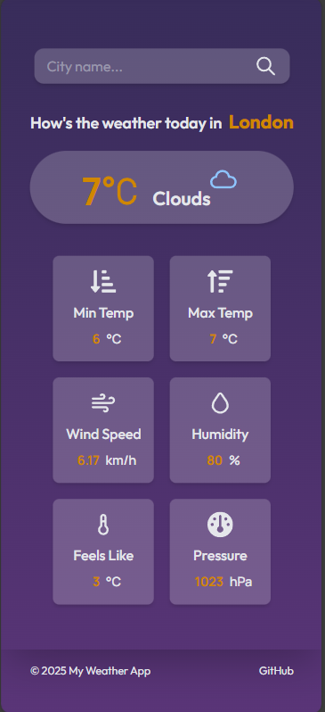

# Weather App

A simple and responsive weather application built with React, Vite, and Tailwind CSS.  
Users can search for any city and instantly view real‑time weather details including temperature, humidity, wind speed, pressure, and more.

## 🔗 Live Demo
[View the app here](https://delaramfarzad9.github.io/weather-app/)

## 📸 Screenshot

## 🛠 Technologies
- React (with Vite)
- Tailwind CSS
- React Icons
- OpenWeather API
- JavaScript (ES6+)
